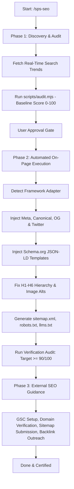

# METHOD-CARD: SPS SEO Engine

**Version:** 1.0.0  
**Domain:** All-in-One Autonomous Technical & On-Page SEO Architecture  
**Compatibility:** Next.js (App & Pages), Astro, Vite/React SPA, Static HTML, Nuxt, SvelteKit, Laravel, Django.

---

## 1. Core Directives & Hard Laws

### Law 1: Zero Hallucination
- Parse actual project files using `scripts/audit.mjs` or direct codebase file inspection.
- Never invent fictitious file paths, non-existent layouts, or imaginary component trees.
- Validate the existence of entry points before generating or injecting code.

### Law 2: Real-Time Knowledge Mandate
- Search engines update continuously. Before initiating an optimization campaign, execute a web search to retrieve the latest Google Core Updates, Spam Updates, and indexing guidelines.
- Never rely solely on pre-trained cutoff knowledge for algorithm policies and Core Web Vitals thresholds.

### Law 3: Framework-Agnostic Surgical Injection
- Dynamically detect the tech stack via `package.json` and framework config files.
- Consult the corresponding adapter in `adapters/`.
- Perform surgical line-level edits; never overwrite entire components or destroy existing business logic.

### Law 4: Deterministic 100-Point Scoring
- Every audit must yield an objective, verifiable score calculated by `scripts/audit.mjs`:
  - **Technical & Crawlability:** 25 pts
  - **Meta Tags & Social Previews:** 25 pts
  - **Semantic Hierarchy (H1-H6):** 25 pts
  - **Schema & AI Search (AEO):** 25 pts
- Baseline audit must be run before modifications; verification audit must be run after modifications.

### Law 5: Dual Memory Synchronization
- Store project SEO variables in `sps-seo-config.json`.
- If an SPS ecosystem directory (`./.sps/`) is present, run `node scripts/sync-config.mjs` to maintain bidirectional synchronization with `./.sps/seo.json`.

---

## 2. Three-Phase Execution Lifecycle

---

## 3. Definition of Done (DoD)

A project is only certified "SPS SEO Compliant" when:
1. Deterministic score in `scripts/audit.mjs` reaches **>= 90/100 (Grade A)**.
2. Exactly one `<h1>` per page with zero skipped heading levels.
3. 100% of images in primary content templates have descriptive `alt` tags.
4. Valid Schema.org JSON-LD script is embedded and passes syntax checks.
5. Valid `sitemap.xml`, `robots.txt`, and `llms.txt` are generated.
6. `sps-seo-audit-report.md` (and `.sps/seo-audit.md` if applicable) is updated.
