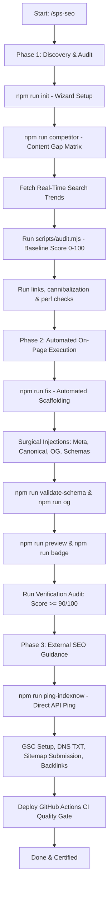

# METHOD-CARD: SPS SEO Engine

**Version:** 1.0.0  
**Domain:** All-in-One Autonomous Technical & On-Page SEO Architecture  
**Compatibility:** Next.js (App & Pages), Astro, Vite/React SPA, Static HTML, Nuxt, SvelteKit, Laravel, Django.

---

## 1. Core Directives & Hard Laws

### Law 1: Zero Hallucination
- Parse actual project files using `scripts/audit.mjs` or direct codebase file inspection.
- Never invent fictitious file paths, non-existent layouts, or imaginary component trees.
- Validate the existence of entry points before generating or injecting code.

### Law 2: Real-Time Knowledge Mandate
- Search engines update continuously. Before initiating an optimization campaign, execute a web search to retrieve the latest Google Core Updates, Spam Updates, and indexing guidelines.
- Never rely solely on pre-trained cutoff knowledge for algorithm policies and Core Web Vitals thresholds.

### Law 3: Framework-Agnostic Surgical Injection
- Dynamically detect the tech stack via `package.json` and framework config files.
- Consult the corresponding adapter in `adapters/`.
- Perform surgical line-level edits; never overwrite entire components or destroy existing business logic.

### Law 4: Deterministic 100-Point Scoring
- Every audit must yield an objective, verifiable score calculated by `scripts/audit.mjs`:
  - **Technical & Crawlability:** 25 pts
  - **Meta Tags & Social Previews:** 25 pts
  - **Semantic Hierarchy (H1-H6):** 25 pts
  - **Schema & AI Search (AEO):** 25 pts
- Baseline audit must be run before modifications; verification audit must be run after modifications.

### Law 5: Low-End Mobile Asset Budget & CLS Protection
- Initial payload must not exceed 1.5MB total asset weight.
- Individual image assets must not exceed 200KB.
- All `` tags must feature explicit `width` and `height` dimensions to prevent layout shifts.
- Follow master guides: [guides/asset-optimization-master.md](guides/asset-optimization-master.md), [guides/lighthouse-100-playbook.md](guides/lighthouse-100-playbook.md), and [guides/third-party-scripts-strategy.md](guides/third-party-scripts-strategy.md).

### Law 6: Internal Link Architecture & Zero Orphans
- Every indexable page must have at least one incoming contextual internal link (`scripts/internal-links.mjs`).
- Never use generic anchor texts ("click here", "read more"); use descriptive, keyword-aligned anchor text.

### Law 7: No Internal Keyword Cannibalization
- Verify that multiple routes are not competing for the exact same target keywords or using duplicate `<title>`/`<meta description>` tags (`scripts/cannibalization.mjs`).

### Law 8: Enterprise Security, Secret Protection & Web Best Practices
- Zero hardcoded secrets, private keys, or exposed `.env` files in `public/` directories (`scripts/security-check.mjs`).
- Configure essential HTTP security headers (`Strict-Transport-Security`, `Content-Security-Policy`, `X-Frame-Options`, `X-Content-Type-Options: nosniff`, `Referrer-Policy`).
- Prevent reverse tabnabbing on all external links (`rel="noopener noreferrer"`).
- Never lock viewport zoom (`user-scalable=no` or `maximum-scale=1` prohibited).
- Zero mixed content (`http://`) on secure HTTPS origins.

### Law 9: Dual Memory Synchronization
- Store project SEO variables in `sps-seo-config.json`.
- If an SPS ecosystem directory (`./.sps/`) is present, run `node scripts/sync-config.mjs` to maintain bidirectional synchronization with `./.sps/seo.json`.

---

## 2. Three-Phase Execution Lifecycle

---

## 3. Definition of Done (DoD)

A project is only certified "SPS SEO Compliant" when:
1. Deterministic score in `scripts/audit.mjs` reaches **>= 90/100 (Grade A)**.
2. Exactly one `<h1>` per page with zero skipped heading levels.
3. 100% of images in primary content templates have descriptive `alt` tags and explicit dimensions (CLS protected).
4. Valid Schema.org JSON-LD scripts pass `scripts/validate-schema.mjs` without errors.
5. Internal linking graph has zero orphan pages (`scripts/internal-links.mjs`).
6. Zero duplicate titles or keyword cannibalization detected (`scripts/cannibalization.mjs`).
7. Asset budget meets low-end mobile limits (≤ 1.5MB total payload, images ≤ 200KB).
8. Valid `sitemap.xml`, `robots.txt`, and `llms.txt` are generated.
9. Branded `og-image.svg` and `seo-score-badge.svg` are generated.
10. Zero critical secret leaks or exposed files in public directories (`scripts/security-check.mjs`).
11. `sps-seo-audit-report.md` (and `.sps/seo-audit.md` if applicable) is updated.
