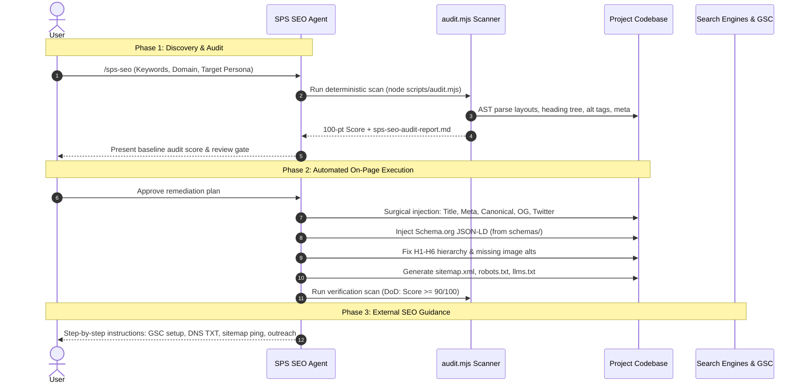

# SPS SEO

> **The Ultimate Framework-Agnostic AI Agent Skill & Deterministic Technical SEO Engine**

[](VERSION)
[](LICENSE)
[](METHOD-CARD.md)
[](guides/aeo-geo-optimization.md)

`sps-seo` is a production-grade, zero-hallucination AI Agent Skill designed to automate and orchestrate technical SEO, on-page optimization, Schema.org rich snippets, and modern Generative Engine Optimization (GEO/AEO).

Compatible with **Claude**, **Cursor**, **Codex**, **Antigravity (Gemini)**, **OpenCode**, and **Windsurf**.

---

## 🌟 Key Highlights

- 🎯 **Deterministic 100-Point Audit Engine:** Zero external dependencies (`node scripts/audit.mjs`). Evaluates codebase AST, heading trees, image alt coverage, meta tags, and schema.
- ⚡ **Framework-Agnostic Adapters:** Native code modification recipes for **Next.js** (App & Pages Router), **Astro**, **Vite / React SPA**, and **Static HTML**, plus universal fallback for Nuxt, SvelteKit, and Laravel.
- 🤖 **2026 AI Search Ready (GEO/AEO):** Built-in support for Google AI Overviews, Perplexity, and ChatGPT Search citation optimization, answer capsules, and automated `llms.txt` generation.
- 🧩 **Schema.org Rich Snippet Suite:** Ready-to-inject JSON-LD templates for `Organization`, `WebSite`, `LocalBusiness`, `Article`, `Product`, `SoftwareApplication`, `FAQPage`, and `BreadcrumbList`.
- 🔄 **SPS Ecosystem Native & Dual-Memory:** Automatic bidirectional sync between root `sps-seo-config.json` and `./.sps/seo.json`.
- 📋 **Zero-Install Portability:** Includes a standalone monolithic [SYSTEM-PROMPT.md](SYSTEM-PROMPT.md) that can be pulled from GitHub or pasted directly into any agent system instructions.

---

## 🏗️ Repository Architecture

```text
sps-seo/
├── SKILL.md                          # Main agent skill specification & prompt entrypoint
├── METHOD-CARD.md                    # Core inlined hard laws, anti-hallucination rules, DoD
├── SYSTEM-PROMPT.md                  # Portable monolithic system prompt for copy-paste / raw GitHub curl
├── sps-seo-config.example.json       # Project configuration template
├── package.json                      # NPM scripts and project metadata
├── README.md                         # Documentation & installation manual
├── VERSION                           # Current skill version stamp (1.0.0)
├── scripts/
│   ├── audit.mjs                     # Zero-dependency deterministic audit scanner (100-pt score)
│   ├── sync-config.mjs               # Dual config synchronizer (.sps/seo.json <-> sps-seo-config.json)
│   ├── generate-sitemap.mjs          # Route discovery, sitemap.xml, robots.txt, llms.txt generator
│   └── install.sh                    # 1-click global or local installer
├── adapters/
│   ├── nextjs-app.md                 # Next.js App Router (layout metadata, generateMetadata)
│   ├── nextjs-pages.md               # Next.js Pages Router (next/head, _app, SEO component)
│   ├── astro.md                      # Astro (<Layout />, props, @astrojs/sitemap)
│   ├── vite-react.md                 # Vite/React SPA (react-helmet-async + index.html fallback)
│   ├── static-html.md                # Raw HTML, semantic landmarks, inline JSON-LD
│   └── universal-fallback.md         # Nuxt 3, SvelteKit, Laravel Blade, Django
├── schemas/
│   ├── organization.json             # Organization & Brand schema
│   ├── website.json                  # WebSite & Sitelinks SearchBox schema
│   ├── local-business.json           # LocalBusiness with Geo & opening hours schema
│   ├── article.json                  # Article & BlogPosting with E-E-A-T author
│   ├── product.json                  # Product & AggregateOffer schema
│   ├── software-app.json             # SoftwareApplication & ratings schema
│   ├── faq.json                      # FAQPage schema
│   └── breadcrumb.json               # BreadcrumbList schema
└── guides/
    ├── phase1-discovery-audit.md     # Discovery intake questions & scoring guidelines
    ├── phase2-codebase-execution.md  # Surgical codebase modification playbook
    ├── phase3-external-seo.md        # GSC setup, DNS verification, indexing requests, backlinks
    ├── aeo-geo-optimization.md       # AI Overviews, answer capsules, citation triggers, llms.txt
    └── core-web-vitals-checklist.md  # LCP, INP (<200ms), CLS optimization checklist
```

---

## 🚀 Quick Installation

### Option 1: 1-Click Global Install (Recommended)
Installs the skill into your machine's global agent skills directory (`~/.agents/skills/sps-seo`):

```bash
git clone https://github.com/your-username/sps-seo.git
cd sps-seo
./scripts/install.sh --global
```

### Option 2: Local Project Install
Installs the skill into a specific project's `./.agents/skills/sps-seo`:

```bash
./scripts/install.sh --local
```

### Option 3: Zero-Install / Standalone Prompt
If using an environment without file access (ChatGPT, Claude Projects, Cursor Rules), copy the contents of [SYSTEM-PROMPT.md](SYSTEM-PROMPT.md) directly into your agent's system prompt or custom instructions.

---

## 🔄 The 3-Phase Operational Protocol



---

## 📊 Deterministic 100-Point Scoring Breakdown

Run the audit anytime:
```bash
node scripts/audit.mjs
```

| Category | Points | Evaluation Details |
| :--- | :--- | :--- |
| **1. Technical & Crawlability** | **25 pts** | `robots.txt` present (8), `sitemap.xml` present (8), framework config (5), `sps-seo-config.json` (4). |
| **2. Meta Tags & Social Previews** | **25 pts** | Title tag length (8), Meta description (8), Canonical tag (4), OpenGraph tags (3), Twitter card (2). |
| **3. Semantic Hierarchy (H1-H6)** | **25 pts** | Exactly one `<h1>` per page (10), sequential heading progression with no skipped levels (8), semantic landmarks (`<main>`, `<header>`, `<footer>`) (7). |
| **4. Schema & AI Search Readiness** | **25 pts** | 100% Image `alt` text ratio (10), Schema.org JSON-LD present (8), `llms.txt` knowledge file present (7). |

---

## ⚙️ Configuration (`sps-seo-config.json`)

Initialize from the template:
```bash
cp sps-seo-config.example.json sps-seo-config.json
```

Sync with `./.sps/seo.json` (if working in an SPS workflow):
```bash
node scripts/sync-config.mjs
```

---

## 📄 License

MIT License © 2026 Shahid
